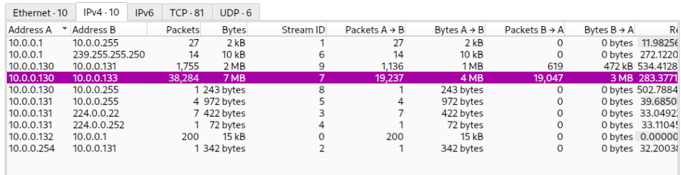

# Wireshark - Lateral Movement Analysis (PsExec/SMB)

**##**

**Overview**

Network forensics investigation of a lateral movement attack. An attacker
compromised one machine and used legitimate Windows administration tools
(PsExec over SMB) to pivot across multiple machines within the network.
This "living off the land" technique uses trusted admin tools to evade detection.

**Category:** Network Forensics / Blue Team  
**Tools:** Wireshark, SMB/SMB2 protocol analysis  
**Techniques:** Lateral movement, PsExec, NTLM authentication analysis  
**MITRE ATT&CK:** T1021.002 (SMB/Windows Admin Shares), T1570 (Lateral Tool Transfer)

---

## **Scenario Summary**

An attacker broke into a machine on the company network and, rather than
stopping, used a legitimate remote administration tool to move laterally:

1. Logged into another machine using valid credentials
2. Installed a temporary service to run remote commands
3. Used hidden Windows administrative shares (ADMIN$, IPC$) to copy and execute the payload
4. Used the newly compromised machine to reach further into the network

**Analogy:** Like a burglar entering one office, finding the master key cabinet,
then walking into other offices with official keys instead of forcing doors.
Because normal admin tools were used, the attack is much harder to detect.

---

## Identifying the Source Machine

### **Task**

Identify the attacker's initial machine from the traffic.

### **Method**

Using Wireshark's **Statistics → Conversations** to review IPv4 traffic volume.

### **Findings**

- Source IP: **10.0.0.130**
- This host generated a huge volume of packets (38,284 packets / 7 MB to 10.0.0.133)
- The abnormal traffic volume flagged it as the attacker's origin machine

Focus on the initial SMB (Server Message Block) negotiation traffic by using the filter smb.cmd == 0x72 or smb2.cmd == 0x00 to Identify the first Source IP address connected via SMB Protocol.

## First SMB Connection (SALES-PC)

### **Task**

Identify the first machine the attacker pivoted to via SMB.

### **Method**

Applied the SMB negotiation filter:

### Findings

- First pivot target identified via NTLM challenge target name: **SALES-PC**
- The NetBIOS domain name attribute confirmed the hostname

## Compromised Username (ssales)

### Task

Identify the username used for authentication.

### Method

Applied the filter:

`ntlmssp.auth.username`

### Findings

- Username: **ssales**
- Session Setup Request revealed `NTLMSSP_AUTH, User: \ssales`
- Additional context extracted: Host name HR-PC, NTLM authentication in use
- The attacker used valid credentials, consistent with a legitimate-looking login

## Malicious Service Name (PSEXESVC)

### Task

Identify the service executable the attacker installed on the target.

### Method

Inspected SMB2 Write Requests for file names.

### Findings

- Service executable: **PSEXESVC.exe**
- This is the signature artifact of **PsExec** — a Sysinternals tool used
legitimately by admins but frequently abused for lateral movement

## Admin Share Used for Installation (ADMIN$)

### Task

Identify which network share PsExec used to install the service.

### Method

Reviewed SMB2 Tree Connect requests and Export Objects (SMB).

### Findings

- Share used: **ADMIN$**
- Tree Connect Request to `\\10.0.0.133\ADMIN$` confirmed
- ADMIN$ maps to the Windows directory and is used by PsExec to drop the service binary
- Export Objects showed PSEXESVC.exe written to this share

## Communication Share (IPC$)

### Task

Identify which share PsExec used for communication.

### Method

Reviewed SMB2 Tree Connect requests.

### Findings

- Share used: **IPC$**
- Tree Connect Request to `\\10.0.0.133\IPC$` confirmed
- IPC$ (Inter-Process Communication) is used by PsExec to send commands and
receive output between machines

## Second Pivot Target (MARKETING-PC)

### Task

Identify the second machine the attacker targeted to pivot further.

### Method

Applied the filter: `ntlmssp.challenge.target_name`

### Findings

- Second target hostname: **MARKETING-PC**
- Packet 39655 revealed the NTLM challenge with NetBIOS domain name MARKETING-PC
- This confirmed the attacker was chaining pivots across the network

## ## Attack Chain Reconstructed

10.0.0.130 (Attacker origin)

│

├──> SMB pivot #1 ──> 10.0.0.133 / 10.0.0.131 (SALES-PC)

│         User: ssales

│         PSEXESVC.exe dropped via ADMIN$

│         Commands via IPC$

│

└──> SMB pivot #2 ──> MARKETING-PC
Continued lateral movement

---

## Key Indicators of Compromise (IOCs)

| Indicator | Value |
| --- | --- |
| Attacker source IP | 10.0.0.130 |
| Malicious service | PSEXESVC.exe |
| Compromised account | ssales |
| Shares abused | ADMIN$, IPC$ |
| Targets | SALES-PC, MARKETING-PC |

---

## Blue Team Recommendations

- Monitor for **PSEXESVC.exe** creation — a strong lateral movement indicator
- Alert on SMB writes to **ADMIN$** shares from non-admin workstations
- Restrict administrative share access where not operationally required
- Enforce least-privilege and monitor NTLM authentication for unusual account usage
- Deploy network segmentation to limit east-west (lateral) traffic between endpoints
- Consider disabling PsExec via application control if not used by IT teams

---

## MITRE ATT&CK Mapping

| Technique | ID |
| --- | --- |
| Remote Services: SMB/Windows Admin Shares | T1021.002 |
| Lateral Tool Transfer | T1570 |
| Valid Accounts | T1078 |
| System Services: Service Execution | T1569.002 |