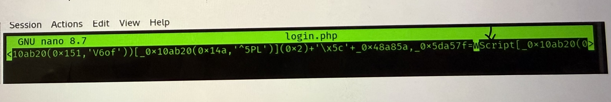

# Wireshark - Malicious Traffic Analysis

## **Overview**

Network traffic analysis exercise using Wireshark to investigate a malicious
PCAP file. The goal is to identify suspicious activity, extract malicious
files, and determine the attack vector and execution process.

**Category:** Network Analysis / Blue Team  
**Tools:** Wireshark, Kali Linux, nano, md5sum, sha256sum  
**Skills:** Packet analysis, HTTP traffic inspection, file extraction, malware identification.

## Identifying the Initial Connection

1. First follow the 3rd alert.


1. Analyze info and search for a file extension.


## **Findings**

- The victim machine (10.2.14.101) performed a DNS lookup for ‘portfolio.serveirc.com’
- DNS resolved to IP `62.173.142.148`
- A TCP SYN packet was sent to port 80, initiating the connection

# Extracting the Malicious File


### Task

Export the malicious file from the packet capture.

### Method

Using Wireshark's Export Objects feature:

- File → Export Objects → HTTP
- Located and exported `login.php` from the HTTP stream

### File Verification

```bash
sha256sum login.php
# Output: 847b4ad90b1daba2d9117a8e05776f3f902dda593fb1252289538acf476c4268
```

### Findings

- The file `login.php` was identified as the malicious payload
- SHA256 hash can be used to search threat intelligence platforms (VirusTotal)

# Identifying the Execution Process

### Task

Determine which process was used to execute the malicious file.

### Method

```bash
# Navigate to Downloads directory
cd Downloads/

# Open the malicious file for inspection
nano login.php

# Search for suspicious strings inside nano
# Ctrl+W → search for "Wscript"
```

### Findings

- Found `Wscript` references inside `login.php`
- **WScript.exe** is a Windows Script Host process
- It is used to execute JavaScript and VBScript files on Windows systems
- The malicious `.js` file was designed to be executed by `WScript.exe`

### Key Takeaway

`login.php` was actually a JavaScript file executed by **WScript.exe** —
a Windows-native scripting engine. This is a common technique used by
threat actors to execute malicious scripts while evading detection.



# Analyzing HTTP Traffic

### Task

Filter and analyze HTTP traffic to identify additional malicious requests.


### Findings

- Initial payload downloaded from `62.173.142.148` via `GET /login.php`
- Secondary payload `resources.dll` downloaded from a different C2 server `188.114.97.3`
- Connectivity test performed via `GET /connecttest.txt` — common in malware
- Multiple C2 servers involved indicates a staged attack

# File Integrity Verification

### Task

Verify the integrity of the extracted `resources.dll` file.


### Method

```bash
# Navigate to Desktop where file was saved
cd Desktop/

# List files
ls

# Generate MD5 hash of the DLL file
md5sum resources.dll
# Output: e758e07113016aca55d9eda2b0ffeebe
```

### Findings

- `resources.dll` was successfully downloaded and saved to the Desktop
- MD5 hash generated for threat intelligence lookup
- This DLL is the secondary payload — likely used for persistence or further exploitation

---

## Summary & Key Takeaways

### Attack Chain Reconstructed

1. Victim visits `portfolio.serveirc.com` → DNS resolves to `62.173.142.148`
2. Server delivers `login.php` — a malicious JavaScript file
3. File executed via **WScript.exe** on the victim's Windows machine
4. Malware downloads secondary payload `resources.dll` from `188.114.97.3`
5. Connectivity test performed — malware confirms internet access

### Tools & Techniques Used

| Tool | Purpose |
| --- | --- |
| Wireshark | Packet capture analysis |
| Export Objects (HTTP) | Extract files from PCAP |
| nano | Inspect file contents |
| sha256sum / md5sum | File integrity verification |

### Blue Team Recommendations

- Block outbound connections to `62.173.142.148` and `188.114.97.3`
- Alert on `WScript.exe` executing downloaded files
- Monitor for unusual DNS queries to dynamic DNS providers ([serveirc.com](http://serveirc.com/))
- Implement application whitelisting to prevent unauthorized script execution